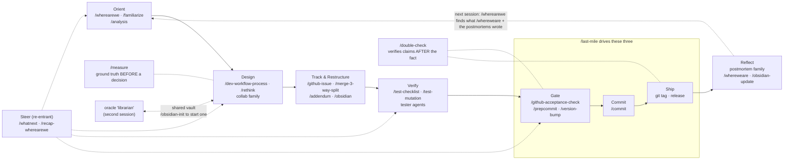

# How the toolkit flows together

These skills, commands, and agents aren't an alphabetical grab-bag — they're stages of one working trajectory. This page walks the lifecycle; each folder's README covers its members in detail.

> **What this page covers, and what this collection ships.** The lifecycle below is the whole trajectory, including stages driven by skills that are not in this repository yet. Eight are named here and not included: `/last-mile`, `/whatnext`, `/recap-wherearewe`, `/measure`, `/rethink`, `/test-mutation`, `/obsidian-update`, and `/obsidian-init`. Until they land, read those stages as a description of the shape rather than as commands you can run. Everything else named below ships here — as a skill in `dotclaude/skills/` or a command in `dotclaude/commands/`.

## 1. Orient

Start a work session by rebuilding context: **`/familiarize`** (session-start context rebuild), or when returning to a project cold, `/wherearewe` (inbound context recovery — finds the snapshots, postmortems, and issues that explain "what's going on here"). For a series of assessment questions, **`/analysis`** applies estimative language (CIA WEP vocabulary) so conclusions carry calibrated confidence. For one-off questions, ask the **`help`**-style research pattern (the `/ask` family).

## Steer (re-entrant — use it at any stage)

Two skills exist for the moment you have lost the thread, which happens most often *between* stages rather than at the start of one.

**`/whatnext`** assesses where the work actually stands — git state, test results, open questions, whether new code is imported by anything — and **dispatches** into the lifecycle: measure, design, plan, implement, review, test, checkpoint, ship, or stop to unblock. It invokes the skill that does the next thing rather than presenting a menu, because a menu hands the decision back, which is what you were trying to avoid by asking.

**`/recap-wherearewe`** is the zoom-out for the person who has been here the whole time and still cannot see the shape: a plain-language recap of what is being worked on right now, an honest count of the threads still open, and a drift check against what you set out to do — with a verdict that is allowed to come back DRIFTED. It stops there; it does not dispatch. `/wherearewe` is for arriving cold; this is for being too warm. The two pair naturally: `/recap-wherearewe` validates the heading, `/whatnext` picks the next one.

## 2. Design

With context in hand, attack the problem with **`/dev-workflow-process`** — the structured Story → Puzzle → Content → Result analysis that writes its reasoning to a durable doc. For particularly tricky designs, escalate to the consultation family: **`/collabN-local`** (N rounds with the repo-aware **`brainstorm`** agent — no external APIs) or **`/collaborate1/2/3`** (external-model consultation via Zen MCP). During design: the **`oracle`** agent traces prior decisions through your notes vault; **`brainstorm`** reads real code as a sparring partner; **`senior-engineer`** analyzes code when you just need expertise; **`dwp-background`** runs a context-free analysis in the background.

Two active tools guard the design against its own assumptions:

- **`/measure`** — establish ground truth empirically *before* a decision rests on it: write a probe, run it against the real population (not a synthetic example), verify the method as well as the result, and reconcile the totals. Use it when someone states a count, a mapping, or a performance figure that nobody actually ran. It is the prospective companion of `/double-check` (below), which validates claims that already exist.
- **`/rethink`** — re-open a conclusion that something is unavailable, impossible, or blocked. A negative ("there is no X", "the only way is Y") is the one claim that verifies itself into false confidence: it is only ever true relative to where you searched, and that scope drops out of the sentence. `/rethink` forces a cross-layer search for alternative suppliers of the thing declared missing, then treats the negative as one pole of an axis and looks for the better third option where a constraint collides with a requirement. Returns REFUTED, NARROWED, or BLOCKED. Cheap and self-applied — no agents, no network.

Branches out of design:
- **New project** → `/create-project` + `/github-issues-setup` (claim issues #1 and #2 before the first push — issue and PR numbers share one sequence, and automation takes #1 otherwise), then **`/obsidian-init`** to bootstrap the project's private vault (MOC, metadata index, open-loops dashboard) so the librarian pattern below has something to read from day one
- **Trackable unit of work** → **`/github-issue`** (template + quality checklist)
- **Refactor** → **`/move-code`** (copy-don't-rewrite migration) and **`/merge-3-way-split`** (pre-merge collision review)
- **Continuously**: capture progress with **`/addendum`** (append to the active design doc), **`/obsidian`** (vault notes), or **`/docidea`** (lightweight idea capture)

## 3. Verify

Once code exists, two skills cover the two halves of "is it tested?":

- **`/test-checklist`** produces the human-runnable checklist that covers what mocks can't (shell rendering, real subprocess behavior, cross-platform quirks), and the **`tester`** / **`tester-unbounded`** agents execute and extend it — `tester-unbounded` runs autonomously inside safety zones enforced by its PreToolUse guard hook.
- **`/test-mutation`** measures the other side: whether the automated tests would *notice* if the code were wrong. A fresh-context generator proposes deliberate bugs from the source alone, a cache-safe harness applies each one and runs the suite, and every survivor is triaged — killable survivors become tests on the spot. A test is not trusted until it has demonstrated that it can fail. Run it at ship time or on request, never as friction while tests are being written.

## 4. Gate, 5. Commit, 6. Ship — driven by `/last-mile`

The steps between "it works" and "it shipped" are always the same set but rarely the same subset. **`/last-mile`** reads what actually changed, classifies it, and *proposes* — version bump, verification depth, what to file, push, tag, closeout — in one batched question block with a recommendation per decision, then runs the stages below and stops at every gate that needs a person. It never assumes the version, never commits without sign-off, and never pushes on its own.

Inside it: **`/github-acceptance-check`** compares the issue's acceptance criteria against what was actually built (run *early* — it can generate work). **`/prepcommit`** handles version bump + docs + staging; **`/version-bump`** encodes the versioning philosophy. Then **`/commit`** — the structured diff-review → message → sign-off → commit ceremony (never auto-committed). When releasing: annotated git tag, then **`/github-release`**.

## Cross-cutting: `/measure` and `/double-check`

These are a before/after pair. **`/measure`** (above) gathers the evidence a decision is about to need. **`/double-check`** verifies *any* set of numbers, calculations, code-facts, or commands you've already put together — it extracts every claim into a ledger, validates each by the right method (run the math, run the command, cite the file/source), and calibrates the language to what was actually verified. In practice it earns its keep most often right before outward communication — issue comments, release notes, emails — making sure you're saying everything properly; but it applies equally to an analysis doc, a benchmark table, or a design's arithmetic.

## 7. Reflect

Close a unit of work with the postmortem family: **`/fullpostmortem`** (completed work), **`/fullpostmortem-lean`** (same, but based purely on in-memory recall), **`/minipostmortem`** (mid-debugging state capture), **`/contextpostmortem`** (session handoff), or **`/postmortem`** (auto-selects). Its forward-looking companion **`/whereweare`** writes the resume-work-after-time-away snapshot: what was done, what's next, key files, open issues. **`/obsidian-update`** then re-syncs the vault — discovers what moved since it last looked (commits, releases, issues, new docs) and updates the MOC, metadata, and open-loops dashboard — so the written record and the knowledge map agree. Together they write the durable record that the next session's `/wherearewe` + `/familiarize` read — closing the loop.

## The librarian pattern (advanced)

A distinctive practice this toolkit supports: run a **second** Claude Code session dedicated to the **`oracle`** agent, continuously building a knowledge map (MOCs) over your `./private/claude/` vault, while the main working session queries it and writes notes back via `/obsidian`. `/obsidian-init` creates the vault; `/obsidian-update` keeps it current after each unit of work. The vault becomes shared memory between sessions — the worker and the librarian.

## Conventions everything assumes

- `./private/claude/` — per-project vault for design docs, postmortems, notes (gitignored)
- `~/claude/` — durable user territory, safe from tool cleanup
- Design docs and postmortems use timestamped filenames (`YYYY-MM-DD__HH-MM-SS__<type>__<topic>.md`) so `ls` shows project history

Task-management integrations (e.g. Todoist-based planning commands) exist in the wider toolkit but aren't published here yet.
