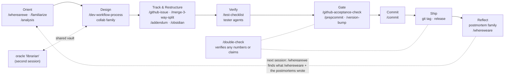

# How the toolkit flows together

These skills, commands, and agents aren't an alphabetical grab-bag — they're stages of one working trajectory. This page walks the lifecycle; each folder's README covers its members in detail.

## 1. Orient

Start a work session by rebuilding context: **`/familiarize`** (session-start context rebuild), or when returning to a project cold, `/wherearewe` (inbound context recovery — finds the snapshots, postmortems, and issues that explain "what's going on here"; later wave). For a series of assessment questions, **`/analysis`** applies estimative language (CIA WEP vocabulary) so conclusions carry calibrated confidence. For one-off questions, ask the **`help`**-style research pattern (the `/ask` family ships in a later wave).

## 2. Design

With context in hand, attack the problem with **`/dev-workflow-process`** — the structured Story → Puzzle → Content → Result analysis that writes its reasoning to a durable doc. For particularly tricky designs, escalate to the consultation family: **`/collabN-local`** (N rounds with the repo-aware **`brainstorm`** agent — no external APIs) or **`/collaborate1/2/3`** (external-model consultation via Zen MCP). During design: the **`oracle`** agent traces prior decisions through your notes vault; **`brainstorm`** reads real code as a sparring partner; **`senior-engineer`** analyzes code when you just need expertise; **`dwp-background`** runs a context-free analysis in the background.

Branches out of design:
- **New project** → `/create-project` + `/github-issues-setup` (later wave)
- **Trackable unit of work** → **`/github-issue`** (template + quality checklist)
- **Refactor** → `/move-code` (copy-don't-rewrite migration) and **`/merge-3-way-split`** (pre-merge collision review) — the former ships in a later wave
- **Continuously**: capture progress with **`/addendum`** (append to the active design doc), **`/obsidian`** (vault notes), or **`/docidea`** (lightweight idea capture)

## 3. Verify

Once code exists: **`/test-checklist`** produces the human-runnable checklist that covers what mocks can't (shell rendering, real subprocess behavior, cross-platform quirks), and the **`tester`** / **`tester-unbounded`** agents execute and extend it — `tester-unbounded` runs autonomously inside safety zones enforced by its PreToolUse guard hook.

## 4. Gate, 5. Commit, 6. Ship

**`/github-acceptance-check`** compares the issue's acceptance criteria against what was actually built. **`/prepcommit`** handles version bump + docs + staging; **`/version-bump`** encodes the versioning philosophy. Then **`/commit`** — the structured diff-review → message → sign-off → commit ceremony (never auto-committed). When releasing: annotated git tag, then `/github-release` (later wave).

## Cross-cutting: `/double-check`

**`/double-check`** verifies *any* set of numbers, calculations, code-facts, or commands you've put together — it extracts every claim into a ledger, validates each by the right method (run the math, run the command, cite the file/source), and calibrates the language to what was actually verified. In practice it earns its keep most often right before outward communication — issue comments, release notes, emails — making sure you're saying everything properly; but it applies equally to an analysis doc, a benchmark table, or a design's arithmetic.

## 7. Reflect

Close a unit of work with the postmortem family: **`/fullpostmortem`** (completed work), **`/minipostmortem`** (mid-debugging state capture), **`/contextpostmortem`** (session handoff), or **`/postmortem`** (auto-selects). Its forward-looking companion `/whereweare` (later wave) writes the resume-work-after-time-away snapshot: what was done, what's next, key files, open issues. Together they write the durable record that the next session's `/wherearewe` + `/familiarize` read — closing the loop.

## The librarian pattern (advanced)

A distinctive practice this toolkit supports: run a **second** Claude Code session dedicated to the **`oracle`** agent, continuously building a knowledge map (MOCs) over your `./private/claude/` vault, while the main working session queries it and writes notes back via `/obsidian`. The vault becomes shared memory between sessions — the worker and the librarian.

## Conventions everything assumes

- `./private/claude/` — per-project vault for design docs, postmortems, notes (gitignored)
- `~/claude/` — durable user territory, safe from tool cleanup
- Design docs and postmortems use timestamped filenames (`YYYY-MM-DD__HH-MM-SS__<type>__<topic>.md`) so `ls` shows project history

Task-management integrations (e.g. Todoist-based planning commands) exist in the wider toolkit but aren't published here yet.
